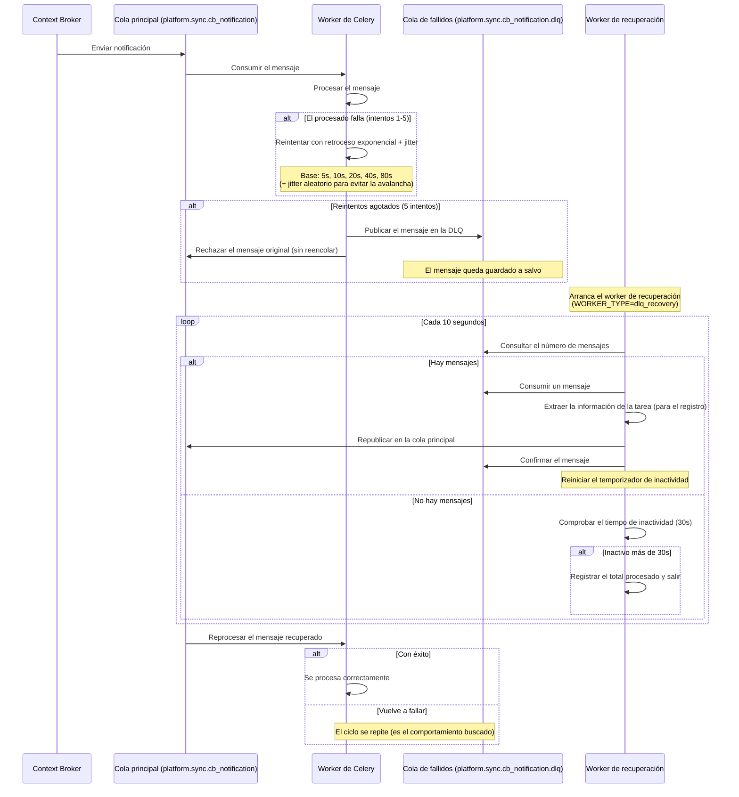

# Proceso de recuperación de la cola de mensajes fallidos (DLQ)

Este documento describe en detalle el sistema de recuperación de la *dead letter queue* (DLQ), su
arquitectura y su flujo de operación.

## 1. Visión general del proceso

El sistema de recuperación de la DLQ es un mecanismo de tolerancia a fallos crítico, pensado para
tratar los mensajes que han fallado repetidamente al procesarse en la cola principal. Garantiza que
**no se pierde ningún dato**: guarda los mensajes fallidos y ofrece un mecanismo de recuperación
controlado.

### Características principales

- **Política de cero pérdida de datos**: los mensajes nunca se descartan; solo se mueven a la DLQ
  para recuperarlos de forma manual o automática.
- **Worker que se apaga solo**: el worker de recuperación de la DLQ termina automáticamente cuando
  se queda inactivo.
- **Control manual del reintento**: los mensajes fallidos se pueden reintentar indefinidamente hasta
  que salgan bien o se purguen a mano.
- **Integridad del mensaje**: se conservan el cuerpo, las cabeceras y las propiedades originales.

El siguiente diagrama ilustra el flujo completo de la DLQ:



## 2. Arquitectura

### 2.1 Configuración de las colas

**Cola principal**: `platform.sync.cb_notification`
- Ubicación: [config/queues.py](../../app/config/queues.py)
- Atiende las notificaciones entrantes del context broker.
- **Sin encaminamiento automático a la DLQ** (el control es manual, en el código de la tarea).
- Prioridad, tiempo límite, número máximo de reintentos y retroceso configurables.

**Cola de mensajes fallidos**: `platform.sync.cb_notification.dlq`
- Ubicación: [config/queues.py](../../app/config/queues.py)
- Cola pasiva (sin consumidores automáticos).
- Guarda los mensajes que han agotado todos los reintentos.
- Solo la consume el worker de recuperación de la DLQ.

### 2.2 Componentes

#### Manejador de la tarea
- **Fichero**: [tasks/sync.py](../../app/tasks/sync.py)
- **Función**: `fiware_orion_subscription_job()`
- **Responsabilidades**:
  - Procesar las notificaciones del context broker.
  - Gestionar los reintentos con retroceso exponencial.
  - Mover a la DLQ los mensajes fallidos tras agotar los reintentos.
  - Rechazar los mensajes de la cola principal para evitar que se reprocesen.

#### Servicio de recuperación de la DLQ
- **Fichero**: [services/dlq_recovery.py](../../app/services/dlq_recovery.py)
- **Función principal**: `run_dlq_recovery()`
- **Funciones auxiliares**:
  - `_extract_message_info()`: extracción segura de los metadatos de la tarea para el registro.
  - `_check_queue_status()`: consulta el número de mensajes pendientes.
  - `_republish_message()`: republica el mensaje conservando todas sus propiedades.
  - `_handle_idle_timeout()`: gestiona la lógica de apagado automático.

## 3. Flujo detallado

### 3.1 Fallo de un mensaje en la cola principal

1. **Ejecución de la tarea**: el worker consume un mensaje de `platform.sync.cb_notification`.

2. **Detección del fallo**: se produce una excepción durante el procesado.

3. **Lógica de reintento** ([tasks/sync.py](../../app/tasks/sync.py)):
   ```python
   # Configuración de la tarea
   retry_backoff=5  # retroceso base en segundos
   retry_backoff_max=600  # máximo de 10 minutos
   retry_jitter=True  # jitter aleatorio para evitar la avalancha

   # Reintento con retroceso exponencial + jitter
   countdown = retry_backoff * (2 ** self.request.retries)
   # Tiempos base: 5s, 10s, 20s, 40s, 80s
   # Tiempos reales: 5s±jitter, 10s±jitter, 20s±jitter, 40s±jitter, 80s±jitter
   ```

   **¿Por qué el jitter?** Cuando fallan varios mensajes a la vez, el jitter evita que todos
   reintenten exactamente en el mismo instante (el problema de la avalancha), y reparte la carga de
   forma más uniforme.

4. **Reintentos agotados** ([tasks/sync.py](../../app/tasks/sync.py)):
   - Registra el fallo con el identificador de la tarea y el detalle del error.
   - Publica el mensaje en la DLQ con `celery_app.send_task()`.
   - Lanza `Reject(requeue=False)` para sacarlo de la cola principal.

### 3.2 Proceso de recuperación de la DLQ

#### Arranque

El worker de recuperación de la DLQ se arranca como un proceso aparte:

**Configuración**: define la variable de entorno `WORKER_TYPE=dlq_recovery`.

**Punto de entrada**: [main.py](../../app/main.py)
```python
if settings.WORKER_TYPE == WorkerType.DLQ_RECOVERY:
    from services.dlq_recovery import run_dlq_recovery
    run_dlq_recovery()
```

#### Bucle de recuperación

1. **Inicializar** ([services/dlq_recovery.py](../../app/services/dlq_recovery.py)):
   - Fija el tiempo de inactividad (por defecto, 30 segundos).
   - Fija el intervalo de comprobación (por defecto, 10 segundos).
   - Inicializa los contadores y el temporizador de actividad.

2. **Consultar el estado de la cola**:
   - Pregunta a la DLQ cuántos mensajes hay pendientes.
   - Si está vacía, comprueba el tiempo de inactividad y puede terminar.

3. **Procesar un mensaje** ([services/dlq_recovery.py](../../app/services/dlq_recovery.py)):
   ```python
   # Consume un mensaje (sin confirmación automática)
   message = dlq_queue(conn).get(no_ack=False)

   # Extrae la información solo para el registro (nunca falla)
   task_name, task_id = _extract_message_info(message)

   # Republica en la cola principal conservando todas las propiedades
   _republish_message(message, SYNC_CB_NOTIFICATION_QUEUE_NAME)

   # Confirma la retirada de la DLQ
   message.ack()
   ```

4. **Actualizar el estado**:
   - Incrementa el contador de procesados.
   - Reinicia el temporizador de inactividad.
   - Registra el éxito con el detalle de la tarea.

5. **Repetir**: vuelve al paso 2.

#### Apagado automático

El worker termina solo cuando:
- La DLQ lleva vacía `idle_timeout` segundos (por defecto, 30).
- Registra: `"DLQ empty for 30s. Total messages processed: X. Exiting."`
- Código de salida: 0 (apagado limpio).

## 4. Configuración

### Variables de entorno

```bash
# Configuración del worker de recuperación de la DLQ
WORKER_TYPE=dlq_recovery  # activa el modo de recuperación
DLQ_RECOVERY_IDLE_TIMEOUT_SECONDS=30  # tiempo de inactividad antes de apagarse
DLQ_RECOVERY_CHECK_INTERVAL_SECONDS=10  # intervalo de comprobación de la cola

# Configuración de la tarea de la cola principal
QUEUE_TASK_CONFIG_PLATFORM_SYNC_CB_NOTIFICATION_MAX_RETRIES=5  # nº de reintentos (por defecto: 5)
QUEUE_TASK_CONFIG_PLATFORM_SYNC_CB_NOTIFICATION_RETRY_BACKOFF=5  # retroceso base en s (por defecto: 5)
QUEUE_TASK_CONFIG_PLATFORM_SYNC_CB_NOTIFICATION_TIMEOUT=300  # tiempo límite de la tarea en s (por defecto: 300)

# Comportamiento del reintento (se configura en el decorador de la tarea, no por entorno)
# retry_backoff_max=600  # el retroceso máximo es de 10 minutos
# retry_jitter=True  # jitter aleatorio activado para evitar la avalancha
```

**Explicación del comportamiento del reintento**:
- **Retroceso base**: se configura con `RETRY_BACKOFF` (por defecto, 5 segundos).
- **Retroceso exponencial**: cada reintento duplica la espera: 5s → 10s → 20s → 40s → 80s.
- **Jitter**: se añade una variación aleatoria a cada retroceso para evitar reintentos simultáneos.
- **Retroceso máximo**: acotado a 600 segundos (10 minutos) con `retry_backoff_max`.
- **Reintentos máximos**: 5 intentos (configurable con `MAX_RETRIES`).

### Configuración de las colas

Ubicación: [config/queues.py](../../app/config/queues.py)

```python
# Cola principal: sin encaminamiento automático a la DLQ
SYNC_CB_NOTIFICATION_QUEUE = Queue(
    name="platform.sync.cb_notification",
    routing_key="platform.sync.cb_notification",
    exchange=PLATFORM_EXCHANGE,
    # Sin queue_arguments: el encaminamiento a la DLQ es manual, en el código de la tarea
)

# Cola de fallidos: almacenamiento pasivo
SYNC_CB_NOTIFICATION_DLQ = Queue(
    name="platform.sync.cb_notification.dlq",
    routing_key="platform.sync.cb_notification.dlq",
    exchange=PLATFORM_EXCHANGE,
)
```

## 5. Operación

### 5.1 Arrancar el worker de recuperación

#### Desarrollo local

```bash
# Ejecución directa
WORKER_TYPE=dlq_recovery python app/main.py

# Despliegue con Docker
docker run -e WORKER_TYPE=dlq_recovery queues-consumer
```

#### Despliegue en Kubernetes

El worker de recuperación se despliega como un Job de Kubernetes que termina solo cuando la DLQ se
queda vacía.

**Arquitectura**:
- **Tipo**: Job de Kubernetes (no Deployment).
- **Política de reinicio**: `Never` (se ejecuta una vez, hasta terminar).
- **Límite de reintentos**: 0 (sin reintentos automáticos si falla).
- **Salida**: termina solo tras `DLQ_RECOVERY_IDLE_TIMEOUT_SECONDS`.

##### Ficheros de configuración

**1. ConfigMap** (`dlq-reprocessor-config`)

Guarda la configuración no sensible:

```yaml
apiVersion: v1
kind: ConfigMap
metadata:
  name: dlq-reprocessor-config
data:
  # Configuración de RabbitMQ
  RABBITMQ_QUEUE: "default"
  RABBITMQ_HOST: "<host-de-rabbitmq>"
  RABBITMQ_PORT: "5671"
  RABBITMQ_VHOST: "<vhost>"
  RABBITMQ_SECURITY: "amqps"

  # Configuración general del worker
  WORKER_TYPE: "dlq_recovery"
  WORKER_CONCURRENCY: "4"

  # Configuración de la recuperación de la DLQ
  DLQ_RECOVERY_IDLE_TIMEOUT_SECONDS: "30"
  DLQ_RECOVERY_CHECK_INTERVAL_SECONDS: "10"
  DLQ_MAX_LENGTH: "15000"
```

**Parámetros de configuración**:
- `WORKER_TYPE`: tiene que ser `"dlq_recovery"` para activar el modo de recuperación.
- `WORKER_CONCURRENCY`: número de hilos (no suele ser determinante en la recuperación de la DLQ).
- `DLQ_RECOVERY_IDLE_TIMEOUT_SECONDS`: tiempo de inactividad antes de apagarse (por defecto, 30 s).
- `DLQ_RECOVERY_CHECK_INTERVAL_SECONDS`: frecuencia con la que se consulta la cola (por defecto,
  10 s).
- `DLQ_MAX_LENGTH`: longitud máxima de la cola (política de RabbitMQ).

**2. Secret** (`dlq-reprocessor-secret`)

Guarda las credenciales sensibles:

```yaml
apiVersion: v1
kind: Secret
metadata:
  name: dlq-reprocessor-secret
type: Opaque
stringData:
  RABBITMQ_USER: "<usuario>"
  RABBITMQ_PASSWORD: "<contraseña>"
```

**3. Definición del Job** (`dlq-reprocessor-job`)

Define el Job de Kubernetes:

```yaml
apiVersion: batch/v1
kind: Job
metadata:
  name: dlq-reprocessor-job
spec:
  backoffLimit: 0  # no reintentar automáticamente los jobs fallidos
  template:
    spec:
      restartPolicy: Never  # el job se ejecuta una vez, hasta terminar
      containers:
        - name: dlq-worker
          image: <registro>/queues-consumer:dlq
          imagePullPolicy: Always
          resources:
            requests:
              cpu: 1000m      # 1 núcleo de CPU
              memory: 1Gi     # 1 GiB de RAM
            limits:
              cpu: 1000m
              memory: 1Gi
          envFrom:
            - configMapRef:
                name: dlq-reprocessor-config
            - secretRef:
                name: dlq-reprocessor-secret
                optional: true
```

**Configuración de recursos**:
- **CPU**: 1000m (1 núcleo), suficiente para procesar mensajes.
- **Memoria**: 1 GiB, para el búfer de mensajes y la sobrecarga de Celery.
- **Política de descarga de imagen**: `Always`, para asegurar la última imagen específica de DLQ.

##### Flujo de despliegue

**1. Crear la configuración**:
```bash
kubectl apply -f dlq-reprocessor-config.yaml
kubectl apply -f dlq-reprocessor-secret.yaml
```

**2. Lanzar la recuperación de la DLQ**:
```bash
kubectl apply -f dlq-reprocessor-job.yaml
```

**3. Seguir el progreso del job**:
```bash
# Observar el estado del job
kubectl get jobs dlq-reprocessor-job -w

# Ver los registros
kubectl logs job/dlq-reprocessor-job -f

# Comprobar que ha terminado
kubectl get jobs dlq-reprocessor-job
# NAME                   COMPLETIONS   DURATION   AGE
# dlq-reprocessor-job    1/1           45s        1m
```

**4. Limpiar al terminar**:
```bash
# Borrar el job completado
kubectl delete job dlq-reprocessor-job

# La configuración y los secretos se quedan para la próxima ejecución
```

##### Ciclo de vida del job

```
┌─────────────────────────────────────────────────────────────┐
│ 1. kubectl apply -f dlq-reprocessor-job.yaml                │
└────────────────────┬────────────────────────────────────────┘
                     │
                     ▼
┌─────────────────────────────────────────────────────────────┐
│ 2. Kubernetes crea el Pod con el contenedor dlq-worker      │
└────────────────────┬────────────────────────────────────────┘
                     │
                     ▼
┌─────────────────────────────────────────────────────────────┐
│ 3. El worker arranca: run_dlq_recovery()                    │
│    - Se conecta a RabbitMQ                                  │
│    - Procesa los mensajes de la DLQ                         │
│    - Los republica en la cola principal                     │
└────────────────────┬────────────────────────────────────────┘
                     │
                     ▼
┌─────────────────────────────────────────────────────────────┐
│ 4. La DLQ se queda vacía                                    │
│    - Inactiva durante DLQ_RECOVERY_IDLE_TIMEOUT_SECONDS (30s)│
└────────────────────┬────────────────────────────────────────┘
                     │
                     ▼
┌─────────────────────────────────────────────────────────────┐
│ 5. El worker sale con código 0 (éxito)                      │
│    - Registra: "Total messages processed: X. Exiting."      │
└────────────────────┬────────────────────────────────────────┘
                     │
                     ▼
┌─────────────────────────────────────────────────────────────┐
│ 6. El job queda marcado como completado                     │
│    - restartPolicy: Never impide que se reinicie            │
│    - Limpieza manual: kubectl delete job                    │
└─────────────────────────────────────────────────────────────┘
```

### 5.2 Intervención manual

#### Purgar mensajes envenenados

Si se determina que un mensaje es irrecuperable (por ejemplo, datos malformados o un fallo
permanente de un servicio externo):

```bash
# Interfaz de gestión de RabbitMQ
# Queues → platform.sync.cb_notification.dlq → Purge Messages
```

#### Inspeccionar el contenido de un mensaje

```bash
# Interfaz de gestión de RabbitMQ
# Queues → platform.sync.cb_notification.dlq → Get Messages → Get Message(s)
```

## 6. Decisiones de diseño

### ¿Por qué el encaminamiento a la DLQ es manual?

La cola principal **no** usa la configuración nativa `x-dead-letter-exchange` de RabbitMQ. En su
lugar, los mensajes se mueven a la DLQ manualmente, desde el código de la tarea.

**Motivos**:
1. **Control fino**: la lógica de reintento de Celery gestiona el retroceso y el número de intentos.
2. **Registro**: se deja constancia detallada del error antes de mover el mensaje a la DLQ.
3. **Flexibilidad**: permite implementar lógica propia (por ejemplo, DLQ distintas según el tipo de
   error).

### ¿Por qué se reintenta indefinidamente desde la DLQ?

Los mensajes recuperados de la DLQ pueden fallar y volver a ella sin límite.

**Justificación**:
1. **Cero pérdida de datos**: es un requisito de negocio crítico; ningún mensaje se descarta
   automáticamente.
2. **Fallos transitorios**: muchos fallos son temporales (problemas de red, reinicios de servicios).
3. **Control manual**: el equipo de operación decide cuándo purgar los mensajes envenenados.
4. **Más vale prevenir**: los falsos negativos (perder datos) son peores que los falsos positivos
   (bucles de reintento).

### ¿Por qué el worker se apaga solo?

El worker de recuperación se apaga automáticamente tras un periodo de inactividad.

**Ventajas**:
1. **Eficiencia de recursos**: no hay workers ociosos consumiendo memoria y conexiones.
2. **Procesado bajo demanda**: lo pueden disparar los sistemas de monitorización y alerta.
3. **Amigable con Kubernetes y contenedores**: un apagado limpio permite una orquestación correcta.
4. **Modelo de proceso por lotes**: está pensado para recuperaciones periódicas, no para operar de
   forma continua.
