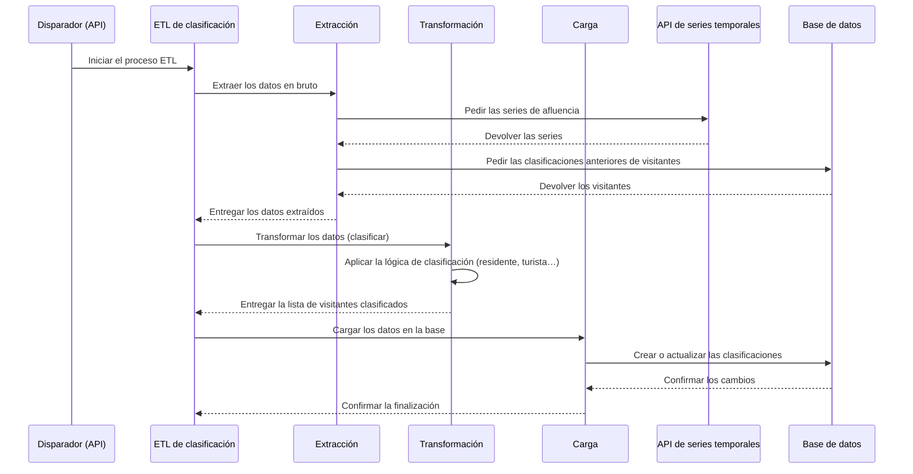

# ETL de clasificación de visitantes

Este documento describe en detalle el proceso ETL de clasificación de afluencia, su configuración y
los pasos que sigue para clasificar los datos de visitantes.

## 1. Visión general del proceso

El proceso ETL extrae datos de afluencia de la API de series temporales, clasifica a los visitantes
según sus patrones de visita y guarda esa clasificación en la base de datos. Así se puede
distinguir entre residentes, turistas y visitantes de corta estancia.

El proceso se puede lanzar manualmente desde un endpoint de la API.

El siguiente diagrama ilustra el flujo del proceso ETL, desde que se dispara hasta el
almacenamiento final.



## 2. Configuración

El proceso ETL se puede iniciar de dos maneras: a mano mediante una llamada a la API, o
automáticamente mediante una tarea periódica programada.

### 2.1. Disparo manual por API

Puedes lanzar el ETL a mano enviando una petición POST al endpoint `/publish`. Es útil para probar
o para procesar rangos de tiempo concretos que no sean los habituales.

#### A) Disparo para entidades concretas (`classification_job`)

Es el caso manual más habitual: lanzas el ETL para una lista concreta de entidades.

-   **Nombre de la tarea**: `platform.crowd.classification_job`
-   **Cuerpo**:

```json
{
  "task": "platform.crowd.classification_job",
  "params": {
    "entities": [{
        "id": 1,
        "tenant": "tu-tenant-1",
        "scope": "tu-scope-1",
        "urn": "urn:ngsi-ld:Device:device-id-1"
      },
      {
        "id": 2,
        "tenant": "tu-tenant-2",
        "scope": "tu-scope-2",
        "urn": "urn:ngsi-ld:Device:device-id-2"
      }
    ],
    "start_date": "2025-09-01T00:00:00",
    "end_date": "2025-09-08T00:00:00",
    "user_id": "tu-id-de-usuario",
    "mode": "weekly"
  }
}
```

-   `entities`: lista de URN de entidad de las que extraer datos.
-   `start_date`: fecha y hora UTC de inicio de la ventana de extracción (formato ISO 8601).
-   `end_date`: fecha y hora UTC de fin de la ventana de extracción (formato ISO 8601).
-   `user_id`: identificador de la persona usuaria que inicia la petición. La clasificación queda
    asociada a ella.
-   `mode`: modo de procesado. Actualmente se admiten `"weekly"` y `"monthly"`.

#### B) Disparo para todas las entidades (`classification_all_job`)

Esta tarea lanza el proceso ETL para **todas** las personas usuarias y sus entidades de afluencia
asociadas.

-   **Nombre de la tarea**: `platform.crowd.classification_all_job`
-   **Cuerpo**:

```json
{
  "task": "platform.crowd.classification_all_job",
  "params": {
    "start_date": "2025-07-27 00:00:00",
    "end_date": "2025-07-28 00:00:00"
  }
}
```

-   `start_date`: fecha y hora UTC de inicio de la ventana de extracción (formato ISO 8601).
-   `end_date`: fecha y hora UTC de fin de la ventana de extracción (formato ISO 8601).
-   `organization_id`: opcional. Si se indica, restringe la ejecución a las entidades de esa
    organización concreta en lugar de procesarlas todas. Útil para relanzar a mano un ETL fallido de
    un solo tenant.
-   `force`: opcional. Con `true`, se salta la comprobación de duplicados y vuelve a ejecutar cada
    job individual aunque ya se hubiera ejecutado con los mismos parámetros. Por defecto, `false`.

**Ejemplo — relanzar para una sola organización, forzando la reejecución:**

```json
{
  "task": "platform.crowd.classification_all_job",
  "params": {
    "start_date": "2025-07-27T00:00:00",
    "end_date": "2025-07-28T00:00:00",
    "organization_id": 5,
    "force": true
  }
}
```

### 2.2. Disparo periódico automático

El ETL está pensado para ejecutarse solo y clasificar los datos de visitantes de forma constante.
De ello se encarga una tarea periódica de Celery.

-   **Tarea programada**: `all_crowd_classification_jobs` es la que se programa para ejecución
    periódica.
-   **Periodicidad**: la define la variable de entorno `CROWD_CLASSIFICATION_INTERVAL`.
-   **Tarea que dispara**: ejecuta `platform.crowd.classification_all_job`, que clasifica a los
    visitantes de todas las personas usuarias.

### 2.3. Configuración general

-   **Base de datos**: la conexión a la base donde se guardan las clasificaciones de visitantes se
    configura por variables de entorno.
-   **Colas**: las tareas de Celery usan colas propias, cuyos nombres definen las variables de
    entorno `CROWD_QUEUE_CLASSIFICATION_NAME` y `CROWD_QUEUE_CLASIFICATION_ALL_NAME`.

## 3. Pasos del ETL

El proceso consta de tres pasos: extracción, transformación y carga.

### 3.1. Extracción

Se encarga de traer los datos de afluencia de la API de series temporales y las clasificaciones de
visitantes que ya existen en la base de datos.

**Pasos:**

1.  **Construir la petición de series**: se construye una petición para la API de series temporales
    indicando los identificadores de dispositivo y el rango de tiempo (`start_date`, `end_date`).
    Las variables que se piden son `visitorId`, `detectionType`, `random` y `cfeBlock`.
2.  **Obtener las series**: se envía la petición a la API y la respuesta se convierte en un
    DataFrame de pandas.
3.  **Obtener los visitantes anteriores**: se consulta la base de datos para obtener la lista de
    visitantes y sus clasificaciones actuales para el `user_id` indicado. Ese histórico se usa en la
    lógica de clasificación.
4.  **Extraer los visitantes únicos**: se extraen los `visitorid` únicos de los datos nuevos.

### 3.2. Transformación

Toma los datos en bruto de las series y clasifica a cada visitante único.

**Pasos:**

1.  **Clasificar visitantes**: la lógica central recorre cada visitante único y lo clasifica según
    su presencia a lo largo del tiempo.
    -   Si aparece en más de 2 días distintos, se clasifica como **«residente»**.
    -   Si ya estaba clasificado como **«residente»** o **«turista»**, se promociona a
        **«residente»**.
    -   Si aparece solo 1 o 2 días pero suma más de 3 horas en total, se clasifica como
        **«turista»**.
    -   En cualquier otro caso, se clasifica como **«visitante de corta estancia»**.
2.  **Preparar la carga**: se prepara la lista final de identificadores de visitante con su nueva
    clasificación.

### 3.3. Carga

Se encarga de guardar en la base de datos las clasificaciones de visitante nuevas o actualizadas.

**Pasos:**

1.  **Guardar los visitantes**: toma la lista de visitantes clasificados.
2.  **Crear o actualizar por lotes**: hace una operación por lotes que crea las entradas de los
    visitantes nuevos o actualiza el `visitor_type` de los que ya existían en la tabla
    `crowd_visitors`, asociada al `user_id`.
