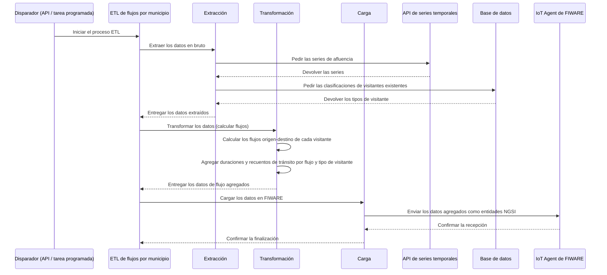

# ETL de flujos de visitantes por municipio

Este documento describe en detalle el proceso ETL de flujos de afluencia por municipio, su
configuración y los pasos que sigue para calcular y almacenar los datos de flujo de visitantes.

## 1. Visión general del proceso

El proceso ETL extrae datos de afluencia en bruto de la API de series temporales, calcula los
flujos de visitantes entre distintas localizaciones (entidades) y envía los resultados agregados a
un IoT Agent de FIWARE. Eso da visibilidad sobre los patrones de tránsito, incluidas la duración y
el volumen, segmentados por tipo de visitante.

El proceso se puede lanzar a mano desde un endpoint de la API o periódicamente desde el
planificador.

El siguiente diagrama ilustra el flujo del proceso ETL, desde que se dispara hasta el
almacenamiento final en el context broker a través del IoT Agent.



## 2. Configuración

El proceso ETL se puede iniciar de dos maneras: a mano mediante una llamada a la API, o
automáticamente mediante una tarea periódica programada.

### 2.1. Disparo manual por API

Puedes lanzar el ETL a mano enviando una petición POST al endpoint `/publish`.

#### A) Disparo para entidades concretas (`flows_municipality_job`)

-   **Nombre de la tarea**: `platform.crowd.flows_municipality_job`
-   **Cuerpo**:

```json
{
  "task": "platform.crowd.flows_municipality_job",
  "params": {
    "entities": [{
        "id": 1,
        "tenant": "tu-tenant-1",
        "scope": "tu-scope-1",
        "urn": "urn:ngsi-ld:Device:device-id-1"
      },
      {
        "id": 2,
        "tenant": "tu-tenant-2",
        "scope": "tu-scope-2",
        "urn": "urn:ngsi-ld:Device:device-id-2"
      }
    ],
    "start_date": "2025-09-15T10:00:00",
    "end_date": "2025-09-15T11:00:00",
    "user_id": "tu-id-de-usuario",
    "mode": "tourism",
    "aggregation_mode": "none"
  }
}
```

-   `entities`: lista de URN de entidad de las que extraer datos.
-   `start_date`: fecha y hora UTC de inicio de la ventana de extracción (formato ISO 8601).
-   `end_date`: fecha y hora UTC de fin de la ventana de extracción (formato ISO 8601).
-   `user_id`: identificador de la persona usuaria que inicia la petición.
-   `mode`: modo de procesado. Actualmente solo se admite `"tourism"`.
-   `aggregation_mode`: define la estrategia de agregación. Puede ser `"none"` u `"origin"`.

#### B) Disparo para todas las entidades (`flows_municipality_all_job`)

Esta tarea lanza el proceso ETL para **todas** las personas usuarias y sus entidades de afluencia
asociadas.

-   **Nombre de la tarea**: `platform.crowd.flows_municipality_all_job`
-   **Cuerpo**:

```json
{
  "task": "platform.crowd.flows_municipality_all_job",
  "params": {
    "start_date": "2025-07-27 00:00:00",
    "end_date": "2025-07-28 00:00:00"
  }
}
```

-   `start_date`: opcional. Inicio de la ventana de procesado (formato ISO 8601). Por defecto, hace
    una hora.
-   `end_date`: opcional. Fin de la ventana de procesado (formato ISO 8601). Por defecto, ahora.
-   `organization_id`: opcional. Si se indica, restringe la ejecución a las entidades de esa
    organización concreta en lugar de procesarlas todas. Útil para relanzar a mano un ETL fallido de
    un solo tenant.
-   `force`: opcional. Con `true`, se salta la comprobación de duplicados y vuelve a ejecutar cada
    job individual aunque ya se hubiera ejecutado con los mismos parámetros. Por defecto, `false`.

**Ejemplo — relanzar para una sola organización, forzando la reejecución:**

```json
{
  "task": "platform.crowd.flows_municipality_all_job",
  "params": {
    "start_date": "2025-07-27T00:00:00",
    "end_date": "2025-07-28T00:00:00",
    "organization_id": 5,
    "force": true
  }
}
```

### 2.2. Disparo periódico automático

El ETL está pensado para ejecutarse solo. De ello se encarga una tarea periódica de Celery.

-   **Tarea programada**: `all_crowd_flows_municipality_jobs`.
-   **Periodicidad**: la define la variable de entorno `CROWD_FLOWS_MUNICIPALITY_INTERVAL`.
-   **Tarea que dispara**: ejecuta `platform.crowd.flows_municipality_all_job`.

### 2.3. Configuración general

-   **IoT Agent de FIWARE**: los datos de conexión se configuran por variables de entorno y
    preferencias.
-   **Colas**: las tareas de Celery usan colas propias, definidas por
    `CROWD_QUEUE_FLOWS_MUNICIPALITY_NAME` y `CROWD_QUEUE_FLOWS_MUNICIPALITY_ALL_NAME`.

## 3. Pasos del ETL

El proceso consta de tres pasos: extracción, transformación y carga.

### 3.1. Extracción

Trae los datos en bruto de la API de series temporales y las clasificaciones de visitantes de la
base de datos.

**Pasos:**

1.  **Obtener las series**: recupera los datos `CrowdFlowEvent` en bruto de la API de series
    temporales para las entidades y el rango de tiempo indicados.
2.  **Obtener las clasificaciones de visitante**: consulta la base de datos para recuperar la
    clasificación ya calculada (residente, turista, visitante de corta estancia) de cada visitante
    asociado a la persona usuaria.

### 3.2. Transformación

Calcula los flujos entre entidades y agrega los datos.

**Pasos:**

1.  **Calcular el flujo del visitante**: por cada visitante único, se analiza su movimiento entre
    entidades (origen y destino) ordenando por tiempo sus registros de detección.
2.  **Clasificar a los visitantes**: se asigna un `visitortype` a cada visitante a partir de las
    clasificaciones recuperadas en la extracción.
3.  **Calcular las duraciones de tránsito**: por cada flujo (par origen-destino) se calculan la
    duración media, la mínima y la máxima.
4.  **Agregar por tipo de visitante**: los cálculos de tránsito se hacen para todos los visitantes
    en conjunto y también para cada tipo por separado (residente, turista, visitante de corta
    estancia).
5.  **Agregar por origen (opcional)**: si `aggregation_mode` vale `"origin"`, el proceso agrega
    además los resultados para dar un resumen por cada punto de origen, aparte de los flujos
    individuales.

### 3.3. Carga

Envía los datos transformados al ecosistema FIWARE a través de un IoT Agent.

**Pasos:**

1.  **Generar el payload**: los datos de flujo agregados se formatean como un JSON conforme al
    modelo de datos `CrowdFlowEventETL`.
2.  **Obtener las credenciales**: se recuperan la clave de API y el endpoint de recurso propios de
    la persona usuaria, necesarios para publicar en el IoT Agent.
3.  **Enviar al IoT Agent**: se envía el payload al IoT Agent, que crea o actualiza las entidades
    correspondientes en el context broker de FIWARE. Cada flujo se convierte en una entidad
    independiente.
