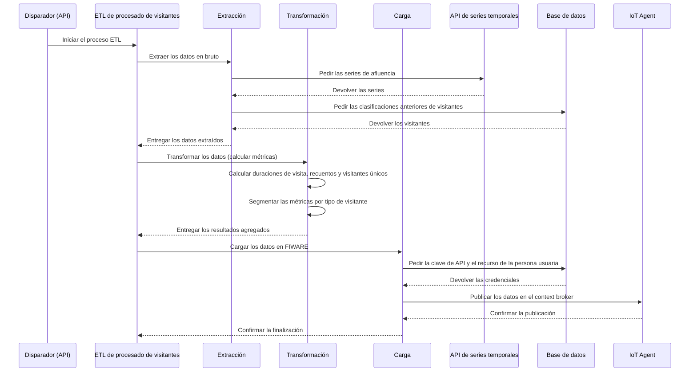

# ETL de procesado de visitantes

Este documento describe en detalle el proceso ETL de procesado de visitantes, su configuración y los
pasos que sigue para procesar y analizar los datos de visitantes.

## 1. Visión general del proceso

El proceso ETL analiza datos de afluencia procedentes de la API de series temporales. Calcula
métricas clave como la duración de la visita (media, mínima y máxima), el total de visitas y el
número de visitantes únicos de las entidades indicadas dentro de una ventana de tiempo.

El proceso se apoya en las clasificaciones de visitante que ya existen (residente, turista,
visitante de corta estancia) para ofrecer analítica segmentada por categoría. Los datos agregados
finales se publican después en un context broker conforme a FIWARE.

El proceso se lanza a mano desde un endpoint de la API.

El siguiente diagrama ilustra el flujo del proceso ETL.



## 2. Configuración

El proceso ETL se inicia con un disparo manual a través de una llamada a la API.

### 2.1. Disparo manual por API

Puedes lanzar el ETL a mano enviando una petición POST al endpoint `/publish`.

#### A) Disparo para entidades concretas (`process_visitors_job`)

-   **Nombre de la tarea**: `platform.crowd.process_visitors_job`
-   **Cuerpo**:

```json
{
    "task": "platform.crowd.process_visitors_job",
    "params": {
    "entities": [{
        "id": 1,
        "tenant": "tu-tenant-1",
        "scope": "tu-scope-1",
        "urn": "urn:ngsi-ld:Device:device-id-1"
      },
      {
        "id": 2,
        "tenant": "tu-tenant-2",
        "scope": "tu-scope-2",
        "urn": "urn:ngsi-ld:Device:device-id-2"
      }
    ],
    "start_date": "2025-08-01T00:00:00",
    "end_date": "2025-09-01T00:00:00",
    "user_id": "tu-id-de-usuario",
    "mode": "tourism",
    "aggregation_mode": "monthly"
  }
}
```

-   `entities`: lista de objetos de entidad, cada uno con su `urn`, `tenant` y `scope`.
-   `start_date`: fecha y hora UTC de inicio de la ventana de extracción (formato ISO 8601).
-   `end_date`: fecha y hora UTC de fin de la ventana de extracción (formato ISO 8601).
-   `user_id`: identificador de la persona usuaria que inicia la petición. Se usa para recuperar las
    claves de API correctas con las que publicar los datos.
-   `mode`: modo de procesado. Actualmente solo se admite `"tourism"`.
-   `aggregation_mode`: define el periodo de agregación.

#### B) Disparo para todas las entidades (`process_visitors_all_job`)

Esta tarea lanza el proceso ETL para **todas** las personas usuarias y sus entidades de afluencia
asociadas, troceado por horas.

-   **Nombre de la tarea**: `platform.crowd.process_visitors_all_job`
-   **Cuerpo**:

```json
{
  "task": "platform.crowd.process_visitors_all_job",
  "params": {
    "start_date": "2025-08-01T00:00:00",
    "end_date": "2025-09-01T00:00:00"
  }
}
```

-   `start_date`: opcional. Inicio de la ventana de procesado (formato ISO 8601). Por defecto, hace
    una hora.
-   `end_date`: opcional. Fin de la ventana de procesado (formato ISO 8601). Por defecto, ahora.
-   `organization_id`: opcional. Si se indica, restringe la ejecución a las entidades de esa
    organización concreta en lugar de procesarlas todas. Útil para relanzar a mano un ETL fallido de
    un solo tenant.
-   `force`: opcional. Con `true`, se salta la comprobación de duplicados y vuelve a ejecutar cada
    job individual aunque ya se hubiera ejecutado con los mismos parámetros. Por defecto, `false`.

**Ejemplo — relanzar para una sola organización, forzando la reejecución:**

```json
{
  "task": "platform.crowd.process_visitors_all_job",
  "params": {
    "start_date": "2025-08-01T00:00:00",
    "end_date": "2025-08-02T00:00:00",
    "organization_id": 5,
    "force": true
  }
}
```

### 2.2. Configuración general

-   **Base de datos**: la conexión se configura por variables de entorno.
-   **Colas**: la tarea de Celery usa una cola propia, que se puede definir con una variable de
    entorno como `CROWD_QUEUE_PROCESS_VISITORS_NAME`.

## 3. Pasos del ETL

El proceso consta de tres pasos: extracción, transformación y carga.

### 3.1. Extracción

Se encarga de traer los datos de afluencia en bruto y las clasificaciones de visitante que ya
existan.

**Pasos:**

1.  **Construir la petición de series**: se construye una petición para la API de series temporales
    indicando las URN de dispositivo, el tenant, el scope y el rango de tiempo (`start_date`,
    `end_date`). Las variables que se piden son `visitorId`, `detectionType`, `random` y `cfeBlock`.
2.  **Obtener las series**: se envía la petición a la API de series temporales (a través de Aether
    Link) y la respuesta se convierte en un DataFrame de pandas.
3.  **Obtener los visitantes anteriores**: se consulta la base de datos para obtener la lista de
    visitantes y sus clasificaciones actuales (residente, turista, etc.) para el `user_id` indicado.
    Estos datos son imprescindibles en el paso de transformación.
4.  **Extraer los visitantes únicos**: se extraen de los datos nuevos los `visitorid` únicos que hay
    que procesar.

### 3.2. Transformación

Calcula todas las métricas de flujo de afluencia.

**Pasos:**

1.  **Calcular el flujo del visitante**: por cada visitante único, se analiza su histórico de
    detecciones para identificar «visitas» distintas a cada entidad y se calcula la duración de cada
    una.
2.  **Clasificar a los visitantes**: a cada visitante del conjunto de datos se le asigna un
    `visitortype` (por ejemplo, residente, turista o visitante de corta estancia) a partir de los
    datos recuperados en la extracción.
3.  **Calcular el número de visitas**: se calcula el total de visitas de cada entidad, también por
    categoría de visitante.
4.  **Calcular los visitantes únicos**: se calcula el número de visitantes únicos de cada entidad,
    igualmente segmentado por categoría.
5.  **Calcular la duración de las visitas**: se calculan la duración media, la mínima y la máxima de
    cada entidad. Estas métricas se calculan también por separado para cada categoría de visitante.
6.  **Agregar los resultados**: todas las métricas calculadas se combinan en un DataFrame final, que
    es la salida del paso de transformación.

### 3.3. Carga

Se encarga de publicar las métricas agregadas en un context broker conforme a FIWARE.

**Pasos:**

1.  **Preparar para FIWARE**: el DataFrame final se procesa para casar con el modelo de datos
    `CrowdFlowEventETL`. Eso implica renombrar columnas y convertir los datos a una estructura tipo
    JSON.
2.  **Generar el payload de cada entidad**: se genera un payload específico por entidad con todas
    las métricas calculadas. Las duraciones se convierten a segundos totales.
3.  **Obtener la clave de API**: se recuperan de la base de datos la `apikey` y el `resource` del
    servicio IoT Agent de la persona usuaria, consultando sus preferencias para dar con el ámbito de
    datos correcto.
4.  **Enviar al IoT Agent**: los payloads generados se publican en el context broker mediante
    `iota_helper`, que envía los datos al endpoint apropiado.

## 4. Modelos de datos

El proceso ETL interactúa con estos modelos principales:

-   **`CrowdVisitor`**: se lee de la base de datos para obtener las clasificaciones de visitante
    preexistentes.
    -   `user_id`: la persona usuaria asociada a este visitante.
    -   `visitor_id`: identificador único del visitante.
    -   `visitor_type`: clasificación del visitante (por ejemplo, residente o turista).

-   **Datos de series temporales**: los datos en bruto de la API de series.
    -   `visitorId`: identificador único del visitante.
    -   `timeinstant`: marca de tiempo de la detección.
    -   `entityId`: la entidad (por ejemplo, el sensor) que detectó al visitante.

-   **`CrowdFlowEventETL`**: el modelo de datos NGSI-LD de destino en el context broker. Sus
    atributos incluyen:
    -   `averageVisitDuration`, `minimumVisitDuration`, `maximumVisitDuration`
    -   `visits`, `uniqueVisitors`
    -   Métricas segmentadas como `touristAverageVisitDuration`, `touristVisits`,
        `residentUniqueVisitors`, etc.

-   **`Preference`**: se lee de la base de datos para determinar el ámbito de datos de la persona
    usuaria a la hora de publicar.
