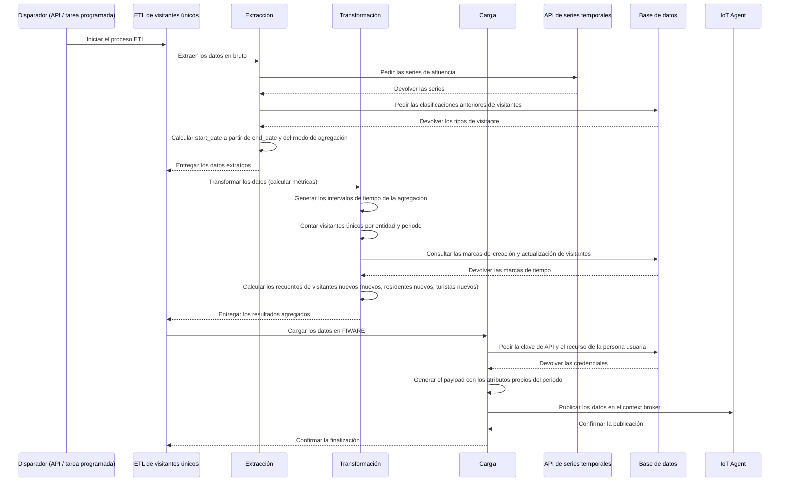

# ETL de visitantes únicos

Este documento describe en detalle el proceso ETL de visitantes únicos, su configuración y los pasos
que sigue para calcular y publicar las métricas de visitantes.

## 1. Visión general del proceso

El proceso ETL extrae datos de afluencia de la API de series temporales, calcula el número de
visitantes únicos y las métricas de visitantes nuevos en periodos de tiempo configurables, y guarda
los resultados agregados. Eso permite hacer analítica de afluencia completa para cuadros de mando,
informes y sistemas de monitorización.

El proceso admite varios modos de agregación (diario, semanal, quincenal y mensual) y sigue tanto el
total de visitantes únicos como los que aparecen por primera vez, incluidos los que se reclasifican
de tipo.

El proceso se puede lanzar a mano desde un endpoint de la API y también automáticamente desde una
tarea periódica programada.

El siguiente diagrama ilustra el flujo del proceso ETL, desde que se dispara hasta el
almacenamiento final.



## 2. Configuración

El proceso ETL se puede iniciar de dos maneras: a mano mediante una llamada a la API, o
automáticamente mediante una tarea periódica programada.

### 2.1. Disparo manual por API

Puedes lanzar el ETL a mano enviando una petición POST al endpoint `/publish`. Es útil para probar.

#### A) Disparo para entidades concretas (`unique_visitors_job`)

Es el caso manual más habitual: lanzas el ETL para una lista concreta de entidades.

-   **Nombre de la tarea**: `platform.crowd.unique_visitors_job`
-   **Cuerpo**:

```json
{
  "task": "platform.crowd.unique_visitors_job",
  "params": {
    "entities": [{
        "id": 1,
        "tenant": "tu-tenant-1",
        "scope": "tu-scope-1",
        "urn": "urn:ngsi-ld:CrowdFlowEvent:device-id-1"
      },
      {
        "id": 2,
        "tenant": "tu-tenant-2",
        "scope": "tu-scope-2",
        "urn": "urn:ngsi-ld:CrowdFlowEvent:device-id-2"
      }
    ],
    "end_date": "2025-09-01T00:00:00",
    "aggregation_mode": "Monthly",
    "user_id": 123,
    "force": false
  }
}
```

-   `entities`: lista de objetos de entidad, cada uno con su `id`, `urn`, `tenant` y `scope`.
-   `end_date`: fecha y hora UTC de fin de la ventana de extracción (formato ISO 8601). La fecha de
    inicio se calcula sola a partir del modo de agregación.
-   `aggregation_mode`: define el periodo de agregación. Puede ser `"Daily"`, `"Weekly"`,
    `"Biweekly"` o `"Monthly"`. Por defecto, `"Daily"`.
-   `user_id`: identificador de la persona usuaria que inicia la petición. Se usa para recuperar las
    claves de API y las clasificaciones de visitante correctas.
-   `force`: booleano opcional para forzar la reejecución aunque el ETL ya se haya ejecutado con
    estos parámetros. Por defecto, `false`.

#### B) Disparo para todas las entidades (`unique_visitors_all_job`)

Esta tarea lanza el proceso ETL para **todas** las personas usuarias y sus entidades de afluencia
asociadas.

-   **Nombre de la tarea**: `platform.crowd.unique_visitors_all_job`
-   **Cuerpo**:

```json
{
  "task": "platform.crowd.unique_visitors_all_job",
  "params": {
    "start_date": "2025-08-01T00:00:00",
    "end_date": "2025-09-01T00:00:00"
  }
}
```

-   `start_date`: opcional. Fecha y hora UTC de inicio de la ventana de procesado (formato ISO
    8601). Si no se indica, ayer.
-   `end_date`: opcional. Fecha y hora UTC de fin de la ventana de procesado (formato ISO 8601). Si
    no se indica, hoy.
-   `organization_id`: opcional. Si se indica, restringe la ejecución a las entidades de esa
    organización concreta en lugar de procesarlas todas. Útil para relanzar a mano un ETL fallido de
    un solo tenant.
-   `force`: opcional. Con `true`, se salta la comprobación de duplicados y vuelve a ejecutar cada
    job individual aunque ya se hubiera ejecutado con los mismos parámetros. Por defecto, `false`.

**Ejemplo — relanzar para una sola organización, forzando la reejecución:**

```json
{
  "task": "platform.crowd.unique_visitors_all_job",
  "params": {
    "start_date": "2025-08-01T00:00:00",
    "end_date": "2025-09-01T00:00:00",
    "organization_id": 5,
    "force": true
  }
}
```

**Nota**: cuando se usa el job «all», el proceso encola automáticamente jobs individuales para cada
día del rango:
- **Jobs diarios**: se encolan todos los días.
- **Jobs semanales**: se encolan los lunes (día de la semana = 0).
- **Jobs quincenales**: se encolan el día 1 y el 16 de cada mes.
- **Jobs mensuales**: se encolan el día 1 de cada mes.

### 2.2. Disparo periódico automático

El ETL está pensado para ejecutarse solo, de forma programada. De ello se encarga una tarea
periódica de Celery.

-   **Tarea programada**: `all_crowd_unique_visitors_jobs`.
-   **Periodicidad**: la define la variable de entorno `CROWD_UNIQUE_VISITORS_INTERVAL`.
-   **Tarea que dispara**: ejecuta `platform.crowd.unique_visitors_all_job` para todas las personas
    usuarias.

### 2.3. Configuración general

-   **Base de datos**: la conexión se configura por variables de entorno.
-   **Colas**: las tareas de Celery usan colas propias, definidas por
    `CROWD_QUEUE_UNIQUE_VISITORS_NAME` y `CROWD_QUEUE_UNIQUE_VISITORS_ALL_NAME`.

## 3. Pasos del ETL

El proceso consta de tres pasos: extracción, transformación y carga.

### 3.1. Extracción

Trae los datos en bruto de la API de series temporales y las clasificaciones de visitante de la base
de datos.

**Pasos:**

1.  **Calcular la fecha de inicio**: a partir de `end_date` y de `aggregation_mode`, la fecha de
    inicio se calcula sola:
    -   `Daily`: start_date = end_date − 1 día
    -   `Weekly`: start_date = end_date − 7 días
    -   `Biweekly`: start_date = end_date − 14 días
    -   `Monthly`: start_date = end_date − 1 mes

2.  **Construir la petición de series**: se construye una petición para la API de series temporales
    indicando las URN de dispositivo, el tenant, el scope y el rango de tiempo (`start_date`,
    `end_date`). Las variables que se piden son `visitorId`, `timeinstant` y `entityId`.

3.  **Obtener las series**: se envía la petición a la API de series temporales (a través de Aether
    Link) y la respuesta se convierte en un DataFrame de pandas. Los datos se cachean en S3 y se
    recuperan de ahí cuando están disponibles.

4.  **Obtener las clasificaciones anteriores**: se consulta la base de datos para obtener todos los
    visitantes y sus clasificaciones actuales (residente, turista, visitante de corta estancia) del
    `user_id` indicado. Esos datos sirven para seguir los visitantes nuevos y las reclasificaciones.

### 3.2. Transformación

Calcula el número de visitantes únicos y las métricas de visitantes nuevos, agregando los datos por
periodos de tiempo.

**Pasos:**

1.  **Validar las marcas de tiempo**: convierte `timeinstant` a formato de fecha y hora y descarta
    las marcas inválidas o ausentes.

2.  **Generar los intervalos de tiempo**: según el modo de agregación, genera los intervalos del
    periodo:
    -   Para `Daily`, `Weekly` y `Monthly`: crea los intervalos contando hacia atrás desde
        `end_date` hasta `start_date`.
    -   Cada intervalo representa un periodo de agregación.

3.  **Contar los visitantes únicos**:
    -   Agrupa los datos por entidad y periodo.
    -   Cuenta cuántos `visitorid` únicos hay en cada grupo.
    -   Genera un `period_date` que representa el final de cada periodo.

4.  **Calcular los recuentos de visitantes nuevos** (solo en los modos que no son diarios):

    a. **Obtener los conjuntos de visitantes de la clasificación**:
       - Consulta la base de datos por los visitantes con `created_at >= start_date` (visitantes
         realmente nuevos).
       - Consulta la base de datos por los visitantes con `updated_at >= start_date` (visitantes
         actualizados o reclasificados).
       - Clasifica los visitantes del periodo actual con la lógica de clasificación existente.
       - Separa los visitantes clasificados en residentes y turistas.

    b. **Calcular las métricas**:
       - `newUniqueVisitors`: número de visitantes con `created_at >= start_date` (los vistos por
         primera vez en este periodo).
       - `newResidentUniqueVisitors`: número de residentes con `updated_at >= start_date` o que
         todavía no estaban en la base de datos (incluye las reclasificaciones de turista a
         residente).
       - `newTouristUniqueVisitors`: número de turistas con `updated_at >= start_date` o que
         todavía no estaban en la base de datos.

    **Nota**: los recuentos de visitantes nuevos siguen tanto a los visitantes genuinamente nuevos
    como a las reclasificaciones. Un visitante que cambia de tipo (por ejemplo, de turista a
    residente) cuenta como «residente nuevo», pero no como «visitante único nuevo».

5.  **Devolver los resultados**: el paso de transformación devuelve:
    -   `result`: DataFrame con el número de visitantes únicos por entidad y periodo.
    -   `new_visitor_counts`: diccionario con las métricas de visitantes nuevos (vacío en modo
        diario).

### 3.3. Carga

Da formato a los datos y los publica en el ecosistema FIWARE a través de un IoT Agent.

**Pasos:**

1.  **Preparar para FIWARE**: el DataFrame se procesa para casar con el modelo de datos
    `CrowdFlowEventETL`:
    -   Las columnas se renombran incluyendo el sufijo del modo de agregación (por ejemplo,
        `uniqueVisitorsMonthly`).
    -   Las fechas de inicio de periodo se calculan a partir de las de fin.

2.  **Generar el payload de cada entidad**: por cada entidad y periodo se crea un payload que
    contiene:
    -   `entityId`: identificador de la entidad (extraído de la URN).
    -   `uniqueVisitors{Modo}`: número de visitantes únicos del periodo.
    -   `newUniqueVisitors{Modo}`: número de visitantes únicos nuevos (solo en modos no diarios).
    -   `newResidentUniqueVisitors{Modo}`: número de residentes nuevos (solo en modos no diarios).
    -   `newTouristUniqueVisitors{Modo}`: número de turistas nuevos (solo en modos no diarios).
    -   `TimeInstant`: marca de tiempo del fin del periodo.
    -   `startDate`: marca ISO 8601 del inicio del periodo.
    -   `endDate`: marca ISO 8601 del fin del periodo.

3.  **Obtener las credenciales**: se recuperan de la base de datos la clave de API y el endpoint de
    recurso propios de la persona usuaria, usando sus preferencias para dar con el ámbito de datos
    correcto.

4.  **Enviar al IoT Agent**: el payload se envía al IoT Agent mediante `iota_helper`, que publica
    los datos en el context broker. Cada combinación de entidad y periodo se envía como una
    actualización independiente.

## 4. Modos de agregación

El ETL admite cuatro modos de agregación, cada uno con métricas sobre periodos de tiempo distintos:

### 4.1. Diario

-   **Periodo**: 24 horas.
-   **Cálculo de la fecha de inicio**: end_date − 1 día.
-   **Métricas de visitantes nuevos**: NO se calculan (siempre 0).
-   **Programación del job**: se encola todos los días.

### 4.2. Semanal

-   **Periodo**: 7 días.
-   **Cálculo de la fecha de inicio**: end_date − 7 días.
-   **Métricas de visitantes nuevos**: se calculan.
-   **Programación del job**: se encola los lunes.

### 4.3. Quincenal

-   **Periodo**: 15 días.
-   **Cálculo de la fecha de inicio**: end_date − 15 días.
-   **Métricas de visitantes nuevos**: se calculan.
-   **Programación del job**: se encola el día 1 y el 16 de cada mes.

### 4.4. Mensual

-   **Periodo**: 1 mes natural.
-   **Cálculo de la fecha de inicio**: end_date − 1 mes (con `relativedelta`).
-   **Métricas de visitantes nuevos**: se calculan.
-   **Programación del job**: se encola el día 1 de cada mes.
