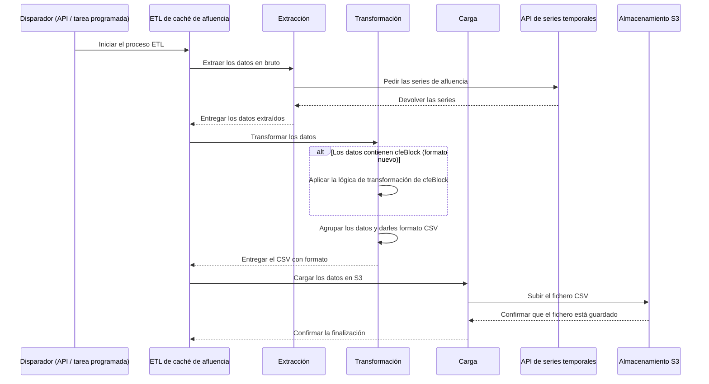

# ETL de caché de datos analíticos

Este documento describe en detalle el proceso ETL de caché de datos de afluencia, su configuración y
los pasos que sigue para procesar los datos.

## 1. Visión general del proceso

El proceso ETL extrae datos de afluencia de la API de series temporales, los transforma y los carga
en un bucket de S3 para almacenamiento a largo plazo. Con ello se reduce el volumen de datos
guardados en la base de series temporales y se mejora el rendimiento de las consultas.

El proceso se puede lanzar a mano desde un endpoint de la API o periódicamente.

El siguiente diagrama ilustra el flujo del proceso ETL, desde que se dispara hasta el
almacenamiento final.



## 2. Configuración

El proceso ETL se puede iniciar de dos maneras: a mano mediante una llamada a la API, o
automáticamente mediante una tarea periódica programada.

### 2.1. Disparo manual por API

Puedes lanzar el ETL a mano enviando una petición POST al endpoint `/publish`. Es útil para probar
o para procesar rangos de tiempo concretos que no sean los habituales.

#### A) Disparo para entidades concretas (`data_cache_crowd_job`)

Es el caso manual más habitual: lanzas el ETL para una lista concreta de entidades.

-   **Nombre de la tarea**: `platform.data_cache.crowd_job`
-   **Cuerpo**:

```json
{
  "task": "platform.data_cache.crowd_job",
  "params": {
    "entities": ["urn:ngsi-ld:Device:device-id"],
    "start_date": "2025-09-15T10:00:00",
    "end_date": "2025-09-15T11:00:00",
    "user_id": "tu-id-de-usuario",
    "force": true
  }
}
```

-   `entities`: lista de URN de entidad de las que extraer datos.
-   `start_date`: fecha y hora UTC de inicio de la ventana de extracción (formato ISO 8601).
-   `end_date`: fecha y hora UTC de fin de la ventana de extracción (formato ISO 8601).
-   `user_id`: identificador de la persona usuaria que inicia la petición. El ETL solo procesará las
    entidades a las que esa persona tenga permiso de acceso.
-   `force`: booleano. Con `true`, el ETL se ejecuta aunque encuentre en la base de datos una
    ejecución anterior con los mismos parámetros. Con `false` o si se omite, se salta la ejecución
    para evitar duplicados.

#### B) Disparo para todas las entidades (`data_cache_crowd_all_job`)

Esta tarea lanza el proceso ETL para **todas** las personas usuarias y sus entidades de afluencia
asociadas.

-   **Nombre de la tarea**: `platform.data_cache.crowd_all_job`
-   **Cuerpo**:

```json
{
  "task": "platform.data_cache.crowd_all_job",
  "params": {
    "start_date": "2025-07-27 00:00:00",
    "end_date": "2025-07-28 00:00:00"
  }
}
```

-   `start_date`: fecha y hora UTC de inicio de la ventana de extracción (formato ISO 8601).
-   `end_date`: fecha y hora UTC de fin de la ventana de extracción (formato ISO 8601).

### 2.2. Disparo periódico automático

El ETL está pensado para ejecutarse solo y cachear los datos de forma constante. De ello se encarga
una tarea periódica de Celery.

-   **Tarea programada**: `all_data_cache_crowd_job`.
-   **Periodicidad**: por defecto está configurada para ejecutarse **cada hora**.
-   **Intervalo**: el intervalo exacto lo define la variable de entorno
    `DATA_CACHE_CROWD_PROCESS_INTERVAL`.
-   **Condición**: la ejecución periódica solo se activa si `settings.IS_ON_PREMISE` es `False`. Por
    tanto, este ETL no se ejecuta en entornos on-premise.

### 2.3. Configuración general

-   **Almacenamiento S3**: la conexión al bucket donde se guardan los datos se configura por
    variables de entorno, que carga el objeto `storage` del módulo `config.config`.
-   **Colas**: las tareas de Celery usan colas propias, cuyos nombres definen las variables de
    entorno `DATA_CACHE_QUEUE_CROWD_NAME` y `DATA_CACHE_QUEUE_CROWD_ALL_NAME`.

## 3. Pasos del ETL

El proceso consta de tres pasos: extracción, transformación y carga.

### 3.1. Extracción

Se encarga de traer los datos de afluencia de la API de series temporales para un conjunto de
entidades y un rango de tiempo concretos.

**Pasos:**

1.  **Construir la petición de series**: se construye una petición para la API de series temporales
    indicando los identificadores de dispositivo, las variables que hay que traer (`CrowdFlowEvent`)
    y el rango de tiempo.
2.  **Obtener las series**: la petición se envía a la API mediante `aether_link_helper`.
3.  **Convertir a DataFrame**: la respuesta JSON de la API se convierte en un DataFrame de pandas
    para facilitar el procesado.
4.  **Procesar los datos en bruto**: se hace una limpieza inicial de los datos y se renombran las
    columnas del DataFrame.
5.  **Agrupar por entidad**: los datos procesados se agrupan por identificador de entidad para
    preparar el paso de transformación.

### 3.2. Transformación

Toma los datos en bruto extraídos de la API de series temporales y los prepara para cargarlos en el
bucket de S3. Eso implica estructurar los datos y generar los metadatos necesarios para el
almacenamiento.

**Pasos:**

1.  **Procesar las series**: el proceso recorre los datos de cada entidad.
2.  **Generar el prefijo de S3**: por cada entidad se genera un prefijo de S3 único a partir de su
    tenant, su scope y su identificador. Ese prefijo determina la ubicación en el bucket.
3.  **Crear el diccionario de resultado**: por cada entidad se crea un diccionario con los datos
    transformados (`df`), el prefijo de S3 (`s3_prefix`), el `filename` y otros metadatos
    relevantes.

### 3.3. Carga

Se encarga de guardar los datos transformados en un bucket de S3. Incluye además un paso para borrar
de la API de series temporales los datos ya procesados y liberar espacio.

**Pasos:**

1.  **Guardar en S3**: el proceso recorre los datos transformados de cada entidad. Los datos se
    guardan como un fichero CSV local temporal, se suben a la ruta de S3 correspondiente y después
    se borra el fichero local.
2.  **Borrar las series**: se construye una petición para borrar de la API de series temporales los
    datos que se acaban de procesar.

## 4. Formato del fichero CSV de salida

El paso final de **carga** del ETL (`CrowdDataCacheLoad`) es el que escribe los datos procesados en
un fichero CSV en S3. Este ETL no agrega datos: guarda las series temporales en bruto, con su
frecuencia original.

#### Estructura de la ruta del fichero

Los ficheros CSV se organizan en el bucket de S3 con una ruta estructurada que permite consultar y
particionar con eficacia. El formato de la ruta es:

`data_cache/crowd/{tenant}/{scope}/{entity_id_short}/{filename}.csv`

-   `tenant`: el tenant asociado a la entidad.
-   `scope`: el service path (scope) de la entidad. Las barras (`/`) se sustituyen por guiones bajos
    (`_`).
-   `entity_id_short`: la última parte de la URN de la entidad.
-   `filename`: el nombre del fichero, que incluye el rango de tiempo que contiene; por ejemplo,
    `2025-09-03T20_00_00_to_2025-09-03T21_00_00.csv`.

#### Marcas de tiempo y columnas

**Nota importante:** todas las marcas de tiempo de la columna `timeinstant` se guardan en **UTC**.
Si no se encuentran datos de la organización en ese periodo para las entidades disponibles, no se
genera ningún CSV para ese rango de tiempo.

El fichero CSV contiene estas columnas, que se corresponden con los datos en bruto del tipo de
entidad `CrowdFlowEvent`:

-   `timeinstant`: (cadena) la hora UTC en formato ISO 8601.
-   `visitorId`: (cadena) identificador único del visitante.
-   `entityId`: (cadena) la URN de la entidad que generó el dato.
-   `period`: (entero)
-   `random`: (booleano)
-   `rssi`: (entero)
-   `detectionType`: (cadena)
-   `signature`: (cadena)
-   `ssid`: (cadena)
