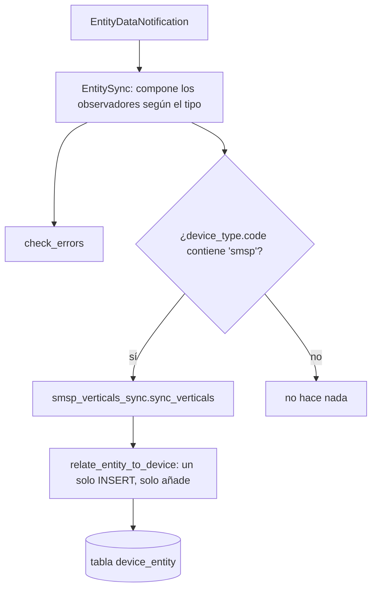

# Sincronización dispositivo ↔ vertical (Smart Spot)

Este documento explica cómo el consumidor (el papel **cb-consumer**) mantiene al día la relación
entre un dispositivo Smart Spot (SMSP) y las verticales que tiene conectadas, en cada notificación
que llega del context broker.

> El único camino que cubre este documento es el de Smart Spot, que es el que usa este despliegue.

## 1. Visión general del proceso

La relación *«qué verticales pertenecen a qué dispositivo»* se guarda en la tabla de unión
`device_entity` (`device_id`, `entity_id`, `entity_type`). La **fila del dispositivo, su `serial`,
su `device_type_id` y su relación inicial con la entidad `main` se crean aguas arriba**: este
consumidor solo mantiene las relaciones con las verticales según van entrando los datos.

El punto de entrada es el job `EntitySync` (`app/jobs/sync/entity_sync.py`). Por cada entidad de
una notificación ejecuta una lista de *observadores*, que
`get_observers_for_notification()` compone según el tipo:

| Observador | De qué se ocupa |
| --- | --- |
| `check_errors` | Errores de la propia notificación |
| `check_smsp_veticals` | Verticales de Smart Spot → `smsp_verticals_sync.sync_verticals` |
| `enqueue_save_realtime` | Encola el guardado del estado en la base `realtime` |
| `sync_entity_workspace` | Solo en entidades recién creadas, y **siempre el último** |
| `save_cfe_commands` | Solo para `CrowdFlowEvent`, en lugar de los dos anteriores |

La sincronización de verticales es **solo de añadir**: se enganchan pero nunca se quitan, porque no
se espera que un Smart Spot pierda verticales.

## 2. Smart Spot — verticales

Fichero: `app/jobs/sync/smsp_verticals_sync.py`

1. Se salta las entidades `DeviceHealthcheck`.
2. Si la entidad **ya** está relacionada con un dispositivo, no hace nada.
3. Deduce el serial de la URN: `urn.split(":")[-1].split("_")[0]`, y luego consulta
   `crud_devices.get_device_by_serial(...)`.
4. Lee el `DeviceType` y filtra por `"smsp" in dt.code`. Solo para dispositivos Smart Spot,
   engancha la entidad vertical con
   `crud_entity.relate_entity_to_device(entity_id, device_id, None)` (un único INSERT, con
   `entity_type=None`).

## 3. La capa de persistencia

- `crud_entity.relate_entity_to_device()` (`app/models/crud/crud_entity.py`) — un INSERT
  incremental: es lo que hace que la sincronización sea de solo añadir.
- `models/device_entity_model.py` — la tabla `DeviceEntity`, que *es* la relación.
- `models/device_types_model.py` — `DeviceType.code` es lo que identifica a un Smart Spot.

## 4. Relacionado

- `app/jobs/sync/standarization.py` — normaliza los atributos de localización de Smart Spot
  (`latitudeLocation` / `longitudeLocation`).
- `app/jobs/sync/entities_location_sync.py` — propaga la localización a la entidad.
- `app/jobs/sync/entity_workspace_context_sync.py` — asocia la entidad a su contexto de trabajo.
